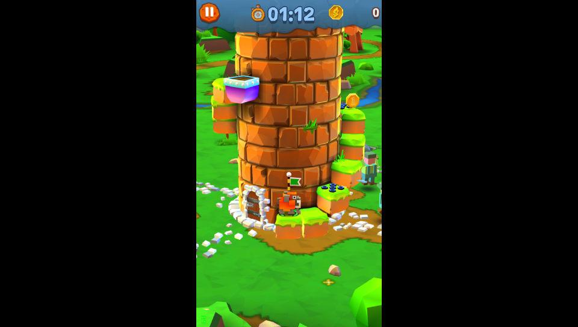

# Rocky Castle Vita

<p align="center"></p>

This is a wrapper/port of <b>Rocky Castle</b> for the *PS Vita*.

The port works by loading the official Android ARMv7 executable in memory, resolving its imports with native functions and patching it in order to properly run.
By doing so, it's basically as if we emulate a minimalist Android environment in which we run natively the executable as it is.

## Notes

- The loader has been tested with v.1.16.15 of the game.
- The game plays in portrait mode and has physical buttons support in the form of the dpad arrows.
- The game is sometimes refered as "Blocky Castle" as well.

## Changelog

### v1.0

- Initial Release.

## Setup Instructions (For End Users)

- Install [kubridge](https://github.com/TheOfficialFloW/kubridge/releases/) and [FdFix](https://github.com/TheOfficialFloW/FdFix/releases/) by copying `kubridge.skprx` and `fd_fix.skprx` to your taiHEN plugins folder (usually `ux0:tai`) and adding two entries to your `config.txt` under `*KERNEL`:
  
```
  *KERNEL
  ux0:tai/kubridge.skprx
  ux0:tai/fd_fix.skprx
```

**Note** Don't install fd_fix.skprx if you're using rePatch plugin

- **Optional**: Install [PSVshell](https://github.com/Electry/PSVshell/releases) to overclock your device to 500Mhz.
- Install `libshacccg.suprx`, if you don't have it already, by following [this guide](https://samilops2.gitbook.io/vita-troubleshooting-guide/shader-compiler/extract-libshacccg.suprx).
- Install the vpk from Release tab.
- Obtain your copy of *Rocky Castle* legally for Android in form of an `.apk`.
- Open the apk with your zip explorer and extract the file `libgame.so` from the `lib/armeabi-v7a` folder to `ux0:data/rocky`.
- Extract the content of the folder `assets` in `ux0:data/rocky`.

## Build Instructions (For Developers)

In order to build the loader, you'll need a [vitasdk](https://github.com/vitasdk) build fully compiled with softfp usage.  
You can find a precompiled version here: https://github.com/vitasdk/buildscripts/actions/runs/1102643776.  
Additionally, you'll need these libraries to be compiled as well with `-mfloat-abi=softfp` added to their CFLAGS:

- [SDL2_vitagl](https://github.com/Northfear/SDL/tree/vitagl)

- [libmathneon](https://github.com/Rinnegatamante/math-neon)

  - ```bash
    make install
    ```

- [vitaShaRK](https://github.com/Rinnegatamante/vitaShaRK)

  - ```bash
    make install
    ```

- [kubridge](https://github.com/TheOfficialFloW/kubridge)

  - ```bash
    mkdir build && cd build
    cmake .. && make install
    ```

- [vitaGL](https://github.com/Rinnegatamante/vitaGL)

  - ````bash
    make SOFTFP_ABI=1 NO_DEBUG=1 INDICES_SPEEDHACK=1 INDICES_DRAW_SPEEDHACK=1 DRAW_SPEEDHACK=1 CIRCULAR_VERTEX_POOL=2 USE_SCRATCH_MEMORY=1 PRIMITIVES_SPEEDHACK=1 HAVE_GLSL_SUPPORT=1 install
    ````

After all these requirements are met, you can compile the loader with the following commands:

```bash
mkdir build && cd build
cmake .. && make
```

## Credits

- TheFloW for the original .so loader.
